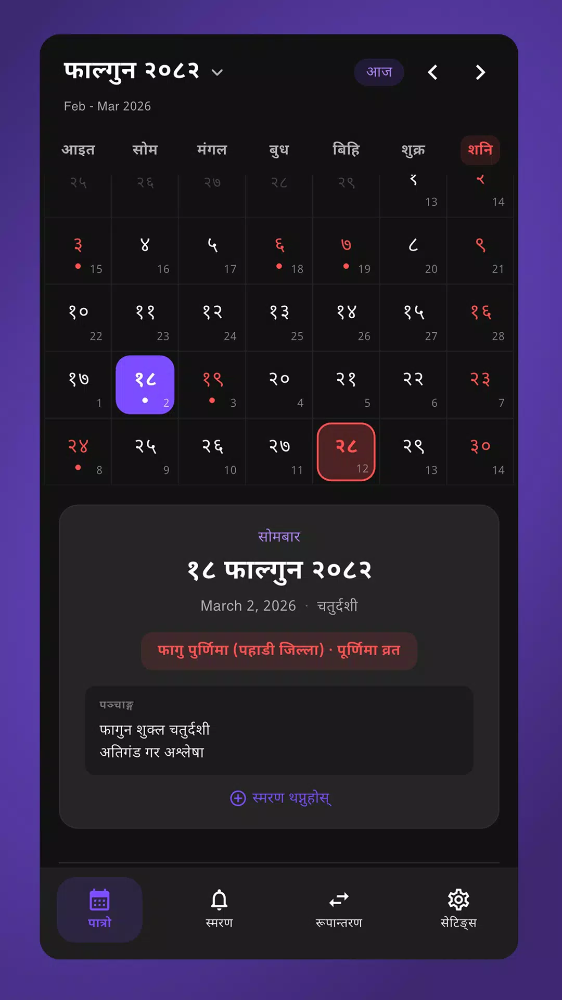
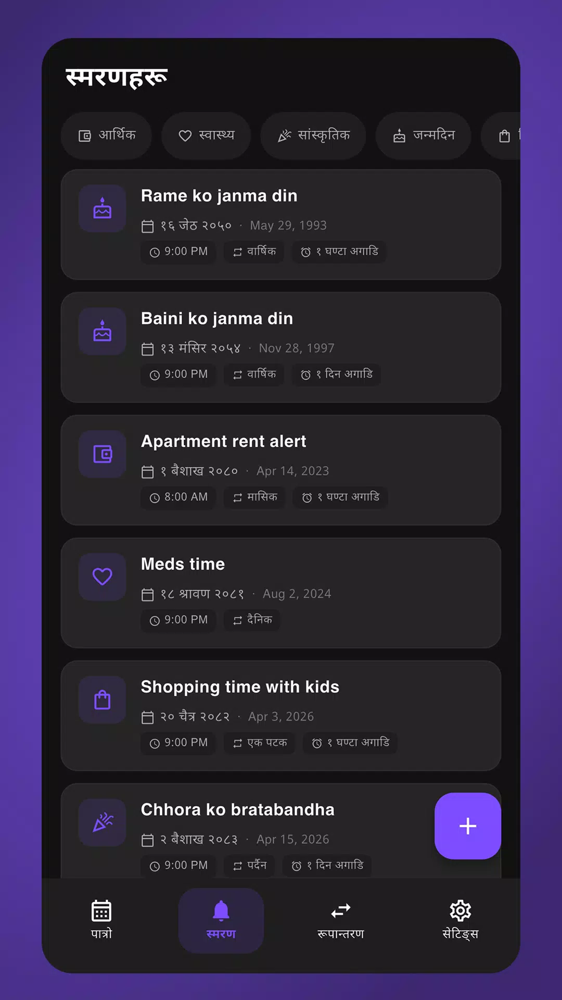
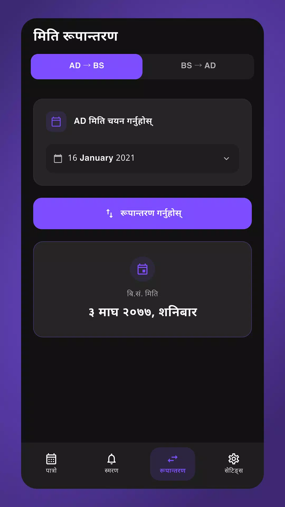
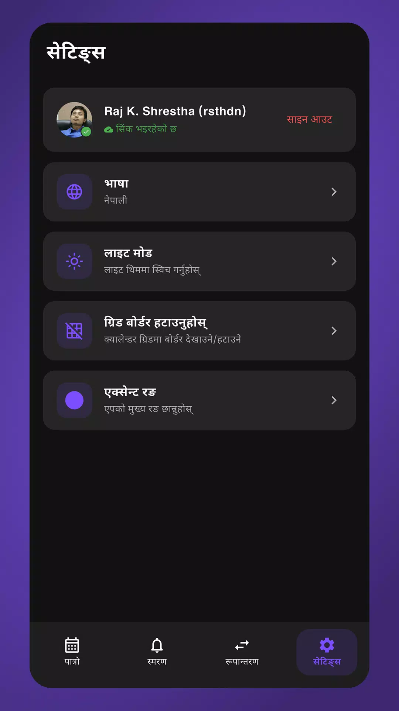

<p align="center">
  
</p>

<h1 align="center">बबाल पात्रो (Babaal Patro)</h1>

<p align="center">
  A modern Nepali Calendar (Bikram Sambat) app built with Flutter.
</p>

<p align="center">
  
  
  
  
  <a href="https://github.com/rajsth/babaal-patro/releases/latest"></a>
</p>

<p align="center">
  <a href="https://github.com/rajsth/babaal-patro/releases/latest">Download APK (Android)</a> · Available on iOS
</p>

---

## Screenshots

<p align="center">
  
  &nbsp;&nbsp;
  
  &nbsp;&nbsp;
  
  &nbsp;&nbsp;
  
</p>

---

## Features

### Calendar
- BS (Bikram Sambat) monthly grid with today highlighted and quick month/year navigation
- Nepali public holiday listings per month
- Selected date banner showing AD equivalent, events, and quick reminder shortcut
- Home screen widget showing today's BS date (Android)

### Reminders (स्मरण)
- Create local push-notification reminders tied to BS dates
- BS → AD conversion handled automatically — notifications fire at the exact Gregorian time
- **BS-aware recurrence:** Monthly and Yearly repeats calculate each occurrence independently from the BS calendar, correctly handling variable month lengths (29–32 days)
- **10 categories** — Personal, Financial, Healthcare, Cultural, Birthday, Anniversary, Invitation, Shopping, Medicine, School — each with a Nepali label and icon
- **Recurrence options** — One-time, Daily, Weekly, Monthly (BS-aware), Yearly (BS-aware)
- **Alert offsets** — At time, 15 minutes before, 1 hour before, 1 day before
- Inline enable/disable toggle per reminder (cancels or reschedules the notification immediately)
- Swipe-to-delete
- Category filter bar on the reminders screen (horizontal scrollable pills)
- Reminders persist across app restarts via SharedPreferences and are rescheduled after device reboot

### Converter
- BS to AD and AD to BS date converter

### Settings
- Multiple accent color themes (8 presets)
- Dark / Light / System theme mode
- Devanagari numerals and Nepali language throughout

## Tech Stack

| Layer | Library |
|---|---|
| Framework | Flutter (Dart) |
| State Management | flutter_riverpod |
| Local Notifications | flutter_local_notifications |
| Timezone | timezone |
| BS/AD Conversion | nepali_utils |
| Persistence | shared_preferences |
| Home Widget | Android AppWidgetProvider (Kotlin), iOS WidgetKit (Swift) |

## Getting Started

### Prerequisites

- Flutter SDK `^3.11.0`
- Java 17 (`JAVA_HOME` should point to JDK 17)
- Android Studio / Xcode

### Run

```bash
flutter pub get
flutter run
```

### Build

```bash
# Android APK
flutter build apk --release

# Android APK split by ABI (smaller downloads)
flutter build apk --release --split-per-abi

# iOS
flutter build ios --release
```

## Project Structure

```
lib/
  core/           # Theme, app colors, Nepali date helpers
  models/         # Reminder model + enums (category, recurrence, alert offset)
  providers/      # Riverpod state (reminders, events, settings, theme)
  screens/        # Calendar, Reminders, Converter, Settings, Splash
  services/       # NotificationService — BS→AD scheduling, recurrence engine
  widgets/        # Calendar grid, date banner, holidays, add-reminder dialog
android/
  app/src/main/
    kotlin/       # Android home screen widget (Kotlin)
    res/          # Widget layouts, drawables
ios/
  NepaliDateWidget/ # iOS home screen widget (SwiftUI / WidgetKit)
```

## Notification Architecture

Notifications are scheduled using `flutter_local_notifications` with `zonedSchedule` against **Asia/Kathmandu** timezone.

- **None / Daily / Weekly** — use the plugin's built-in `DateTimeComponents` repeat
- **Monthly (BS)** — pre-schedules 24 individual AD-converted occurrences
- **Yearly (BS)** — pre-schedules 5 individual AD-converted occurrences

Each occurrence is converted from BS → AD independently using `nepali_utils`, so months with 29, 30, 31, or 32 days are all handled correctly without fixed-interval approximations.

## License

MIT
